<!-- Note: Figure paths are relative to the manuscript/ directory -->

# Abstract

Chamber-based CH~4~ flux measurements increasingly capture ecosystem components whose fluxes are small, near-detection, or intermittently negative, making data processing choices consequential for reported results. Researchers processing such data face a sequence of largely unconsidered decisions: how to estimate instrument detection limits, which measurements to retain, what to do with below-detection values, and how to transform data for statistical analysis. Each choice interacts with the others, and errors compound downstream. We address each issue empirically using chamber CH~4~ flux datasets from Harvard Forest and Yale-Myers Forest, spanning ecosystem components with very different flux magnitudes and negative-value prevalence. Empirical CH~4~ precision estimated from the continuous analyzer timeseries differed substantially from manufacturer specifications, with discrepancies ranging from four-fold worse to better-than-spec across instruments; this variation propagated directly into detection limit calculations, with three published minimal detectable flux (MDF) methods flagging 20--62% of measurements as below detection depending on the precision estimate and confidence level used. Sensitivity analysis across 13 quality filter criteria applied to a multi-tissue canopy dataset showed that stand-level CH~4~ budgets were stable within 16% across all filter definitions, but individual component flux rates---particularly leaves---varied by up to 100% depending on filter choice and outlier treatment. Critically, removing below-detection measurements from the dataset inflated the mean flux by 17--135% and the median by 40--319% relative to the unfiltered baseline, with bias scaling monotonically with filter stringency; retaining original values and flagging detection status is the only treatment that preserves both statistics. Finally, the log transformation commonly applied to flux data silently drops 10--83% of measurements across ecosystem types because it cannot accommodate negative values, introducing a systematic upward bias; the arcsinh transformation is a direct replacement that handles negative values, stabilizes variance across components, and introduces no data loss. We provide question-dependent recommendations for each processing step and a reporting checklist to support cross-study comparability.

\newpage

# Introduction

Chamber-based measurements of CH~4~ flux are used across a broad range of ecosystem components, from wetland soils with large, temporally variable emissions to tree stems, branches, and leaves whose fluxes are often small and close to the detection limit of field-deployable analyzers. The methodological literature has devoted considerable attention to the design of chamber systems, the selection of flux-fitting models, and the appropriate temporal resolution of measurements. Comparatively little attention has been paid to the sequence of data processing choices that follow raw flux computation: how to characterize instrument precision and set detection thresholds, which measurements to retain or discard, how to treat measurements that fall below detection, and how to transform flux distributions for statistical analysis.

These choices are not merely technical details. Each step in the processing pipeline introduces potential bias, and the choices interact: an overly conservative detection limit combined with removal of below-detection values and log transformation of the remainder compounds three independent sources of positive bias into the reported flux estimate. The magnitude of these biases depends on the fraction of measurements near detection---which in turn depends on the true flux magnitude, the instrument precision, and the chamber geometry---but can reach or exceed 100% of the true flux for small-flux components such as leaf or dormant-season stem emissions.

Three interconnected issues motivate this paper. First, minimal detectable flux (MDF) calculations require a precision estimate, and manufacturer specifications are routinely used as a convenient default. We show that empirical precision estimated from the analyzer timeseries can differ substantially from the datasheet value in either direction, and that this discrepancy propagates directly into detection thresholds and the fraction of measurements flagged as below detection. Second, quality filtering involves two distinct choices that are often conflated: the choice of detection criterion and the treatment of measurements that fail it. We show that the treatment---whether to remove below-detection measurements, set them to zero, or retain them with a flag---is more consequential for reported means and medians than the choice of detection threshold itself. Third, the log transformation applied to flux data for variance stabilization and normalization silently discards negative values, which are common in mixed-sign distributions such as those from methanotrophic soils or near-detection stem fluxes; the arcsinh transformation provides a drop-in replacement that handles the full real line without data loss.

We address each issue empirically using chamber CH~4~ flux datasets from Harvard Forest and Yale-Myers Forest, spanning ecosystem components with very different flux magnitudes and negative-value prevalence. Our goal is not to prescribe a single processing protocol, but to document the consequences of each choice and provide question-dependent recommendations that allow researchers to select the approach appropriate for their scientific objective.

# Methods

## Study sites and datasets

[Full site descriptions for Harvard Forest and Yale-Myers Forest to be added here.] Three datasets are used throughout this analysis. The Harvard Forest canopy dataset (n = 136 measurements) spans four tissue compartments---stem below 2 m, stem above 2 m, branches, and leaves---sampled using ABB GLA131-series Microportable Greenhouse Gas Analyzers (UGGA; hereafter GLA131). The Harvard Forest stem monitoring dataset (n = 1,640 measurements) comprises stem flux measurements from 2023--2024 using GLA131 instruments (n = 1,142) and 2025 using the LI-COR LI-7810 (n = 498). The Yale-Myers Forest datasets include stem flux measurements (n = 369) and wetland soil flux measurements (n = 288) collected with GLA131 instruments; these are used primarily for the data transformation comparison (@sec-transformation).

## Instruments and chamber geometry

GLA131-series analyzers use off-axis integrated cavity output spectroscopy (OA-ICOS) and report dry-mole-fraction CH~4~ and CO~2~ at 1 Hz. The manufacturer specifies CH~4~ precision of 0.9 ppb and CO~2~ precision of 0.35 ppm (1-sigma at 1 s averaging). The LI-COR LI-7810 is a cavity ring-down spectrometer with manufacturer-specified CH~4~ precision of 0.6 ppb (1-sigma at 1 s).

All stem measurements used permanent collars with radius 5.08 cm (surface area = 0.00811 m^2^). Chamber volume was computed from measured tree diameters and collar depth for each tree, with an additional 0.028 L for connecting tubing. The flux term---encoding ambient pressure, chamber volume, surface area, and temperature via the ideal gas law---was computed per measurement using the goFlux R package.

## Empirical precision estimation

### Allan deviation (per-measurement)

For each flux measurement, we estimated Allan deviation at $\tau$ = 1 s from the dry-mole-fraction timeseries within the measurement window. Because concentrations change monotonically during a chamber closure, the flux-driven trend was removed by first-differencing before estimating noise, yielding a measurement-specific precision estimate that is independent of the flux model fit.

### Rolling window scan (per-instrument)

We scanned the full continuous timeseries for each instrument using a 30-second rolling window. For each window we computed the absolute slope (via linear regression) and the residual standard deviation around the fit. Windows were ranked by a combined normalized score of |slope| + residual SD; the bottom 5% (flattest and quietest) were selected as representative of the true instrument noise floor. This yields a single global precision estimate per instrument that is used in the Wassmann MDF calculation (@sec-mdf).

## Minimal detectable flux (MDF) calculation approaches {#sec-mdf}

We computed MDF using three published approaches, all sharing the general form:

$$\text{MDF} = \frac{\text{precision\_term}}{t} \times \text{flux\_term}$$

where $t$ is measurement duration in seconds and flux\_term encodes chamber volume-to-area ratio and temperature via the ideal gas law, computed per measurement by goFlux. The three approaches differ in their precision term and confidence scaling:

- **Manufacturer MDF (goFlux).** Uses the GLA131 datasheet precision (0.9 ppb CH~4~): $\text{MDF} = \text{precision}_\text{manufacturer} / t \times \text{flux\_term}$.

- **Wassmann et al. (2018).** Uses the global empirical precision from the rolling window method, scaled for the desired confidence level: $\text{MDF} = (z \times \text{SD}_\text{global}) / t \times \text{flux\_term}$, where $z$ = 2.576, 1.960, or 1.645 for 99%, 95%, and 90% confidence respectively.

- **Christiansen et al. (2015) MQL variant.** Uses the per-measurement Allan deviation, a factor of 3, and the t-distribution critical value: $\text{MDF} = (\text{SD}_\text{Allan} \times 3 \times t_\text{crit}) / t \times \text{flux\_term}$, where $t_\text{crit}$ is the two-tailed t critical value at the specified confidence level with df = $t - 2$. Computed at 99%, 95%, and 90% confidence.

The relationship between MDF and measurement duration is illustrated in @fig-mdf-duration.

{#fig-mdf-duration width=90%}

## Additional quality filter criteria

Beyond MDF, we evaluated several additional quality filters commonly applied to chamber flux data:

- **CH~4~ R^2^ thresholds (> 0.7, > 0.9):** Coefficient of determination from the best-fit model (linear or Hutchinson-Mosier, as selected by goFlux).
- **CO~2~ R^2^ threshold (> 0.7):** Applied to the concurrent CO~2~ flux from the same measurement as an independent check on measurement quality.
- **Signal-to-noise ratio (SNR) thresholds (> 2, > 3):** Defined as |CH~4~ flux| / noise\_floor, where noise\_floor = $\sigma_\text{Allan} / t \times \text{flux\_term}$ converts the per-measurement Allan deviation to flux units.

## Quality filter sensitivity analysis

To assess how the choice of quality filter propagates through component and whole-tree flux scaling, we applied each of 13 criteria independently to the Harvard Forest canopy dataset (n = 136 measurements). For each filter, measurements failing the criterion had their CH~4~ flux set to zero; passing measurements retained their original flux values. We then computed mean per-tissue flux rates for four compartments (stem < 2 m, stem $\geq$ 2 m, branches, leaves) and scaled these by Whittaker and Woodwell (1967) surface area indices (stem bark = 0.45, branch bark = 1.70, LAI = 4.5 m^2^ m^-2^ ground) to obtain integrated stand-level budgets.

## Below-MDF treatment comparison

For each of seven MDF thresholds (Manufacturer, Wassmann 90/95/99%, Christiansen 90/95/99%), we applied three treatments to measurements flagged as below detection: (1) **Remove:** exclude below-MDF measurements from the dataset entirely; (2) **Set to zero:** replace below-MDF flux values with zero, preserving sample size; and (3) **Keep original (flag only):** retain all measured flux values and flag each measurement as above or below its per-measurement MDF.

## Data transformations

We compared three transformations---raw (untransformed), log~10~, and arcsinh---across three datasets spanning a range of negative-flux prevalence (wetland soil, tree stem, tree canopy). For each transformation we report data retention, the Shapiro-Wilk W statistic, and the variance ratio across components.

\newpage

# Detection limits {#sec-detection}

## Empirical precision vs. manufacturer specification

Empirical CH~4~ precision varied substantially across instruments and estimation methods (@fig-precision). For LGR1, the median Allan deviation (3.6 ppb) was four times the manufacturer specification (0.9 ppb), and the rolling window estimate (2.5 ppb) was nearly three times the specification. LGR3 showed a more moderate discrepancy (Allan deviation 1.5 ppb, rolling window 1.2 ppb). LGR2 was the exception: both empirical estimates (Allan deviation 0.6 ppb, rolling window 0.7 ppb) were better than the datasheet value.

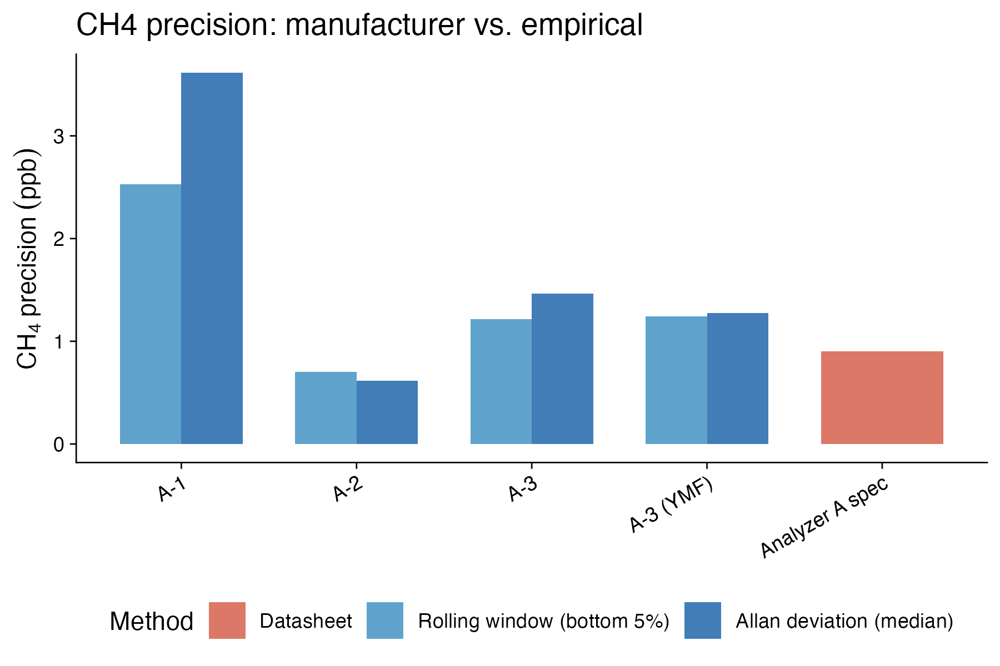{#fig-precision width=85%}

In the multi-instrument stem monitoring dataset, the GLA131 median Allan deviation across 1,206 measurements was 4.0 ppb (IQR: 3.2--4.9 ppb), 4.4$\times$ worse than the manufacturer specification. The LI-7810 median was 0.095 ppb (IQR: 0.086--0.108 ppb), 6.3$\times$ better than its specification, with a remarkably tight distribution spanning less than a factor of 1.3 across the interquartile range (@fig-allan-violin).

{#fig-allan-violin width=75%}

## Consequences for MDF thresholds and detection rates

The three MDF approaches produced detection thresholds spanning roughly an order of magnitude for CH~4~ (@fig-mdf-dist, @fig-mdf-rates). The manufacturer-based MDF was the most permissive for canopy data, flagging 20% of CH~4~ measurements as below detection. Wassmann thresholds (which substitute empirical global precision for the datasheet value) flagged 26--34%, depending on confidence level. The Christiansen approach---which combines per-measurement Allan deviation with a factor of 3 and a t-distribution critical value---was the most conservative, flagging 52--62% as below detection.

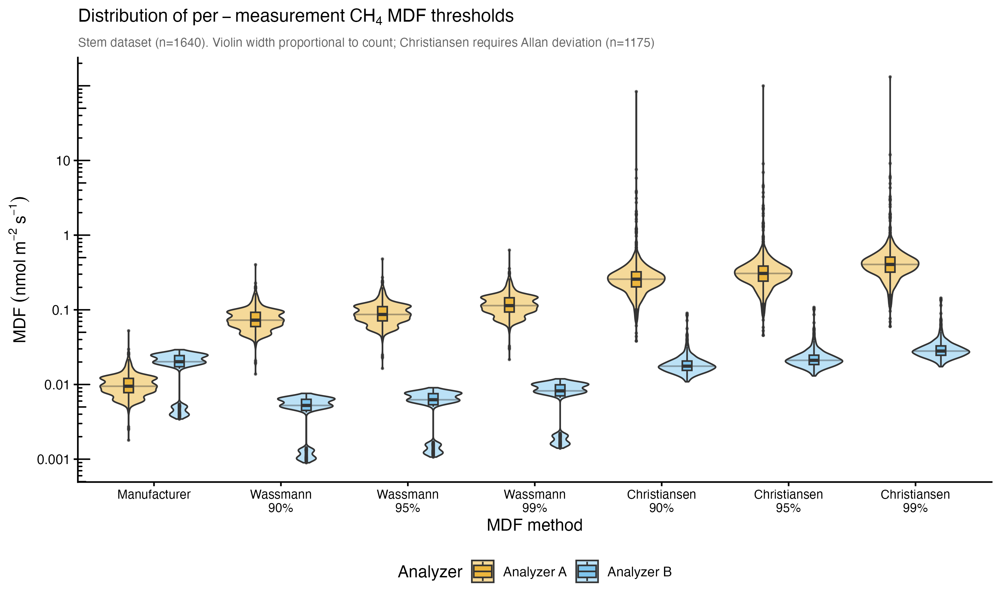{#fig-mdf-dist width=90%}

In the multi-instrument stem dataset, instrument-specific Wassmann global SDs (GLA131: 4.0 ppb, LI-7810: 0.095 ppb) produced thresholds roughly 40$\times$ higher for GLA131 measurements. Consequently, Wassmann 99% flagged 52% of GLA131 measurements but only 15% of LI-7810 measurements as below detection (@fig-mdf-rates).

{#fig-mdf-rates width=90%}

## Negative fluxes: noise or biology?

The stem flux dataset contained 284 negative CH~4~ flux measurements (17.3% of 1,640), distributed asymmetrically between instruments: 275/1,142 (24.1%) for the GLA131 vs. 9/498 (1.8%) for the LI-7810. Three lines of evidence indicate that the majority of GLA131 negative fluxes reflect instrument noise rather than biological CH~4~ uptake:

- **Apples-to-apples seasonal comparison.** Restricting the comparison to overlapping calendar months (June--October), the GLA131 still showed 20.3% negative fluxes (169/832) vs. 1.7% (6/353) for the LI-7810---same trees, same season, same chambers.

- **Noise floor analysis.** Of 246 GLA131 negative fluxes with Allan deviation estimates, 52% had absolute values within 1$\sigma$ of the per-measurement noise floor, 74% within 2$\sigma$, and 84% within 3$\sigma$ (@fig-noise-floor).

- **Distribution shape.** On the GLA131, the near-zero flux distribution was roughly symmetric around a small positive value, consistent with Gaussian noise broadening a weakly positive signal. On the LI-7810, the same trees resolved as a tight, positively-skewed distribution with almost no negative tail.

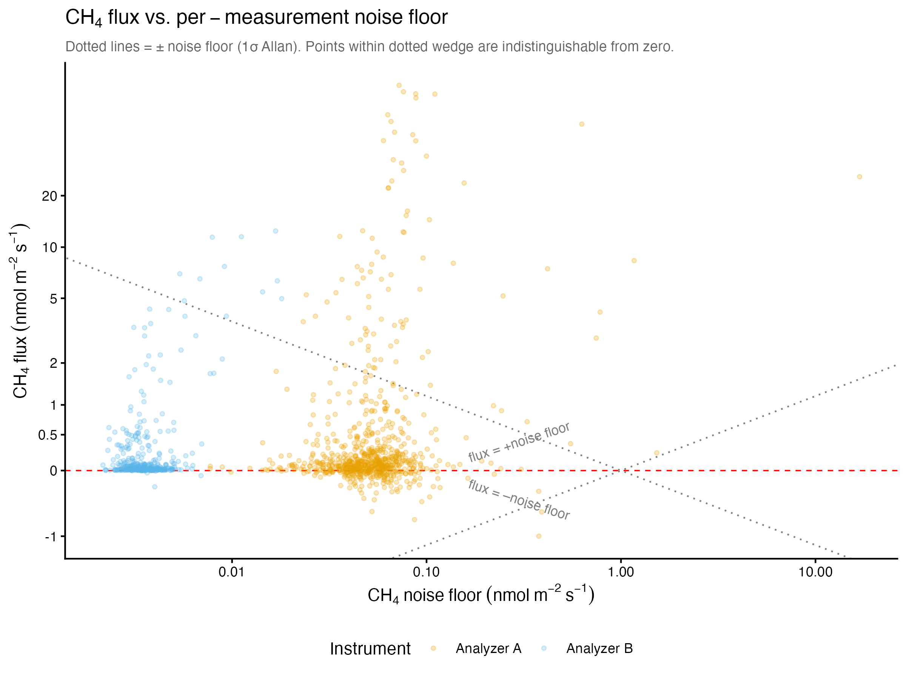{#fig-noise-floor width=85%}

\newpage

# Quality filtering

## Two distinct quality questions

Quality filtering of chamber flux data conflates two genuinely distinct questions that require different tools and different logic. The first is a question of **measurement validity:** was this closure conducted correctly, with no leaks, equipment malfunctions, or procedural errors? The second is a question of **signal detectability:** was the flux large enough relative to instrument noise to be distinguishable from zero? These are independent. A perfectly valid closure can yield a below-detection flux. A corrupted closure can produce a concentration change that passes every statistical detection criterion.

## Assessing measurement validity

The most useful diagnostic for detecting invalid closures is CO~2~ flux as a process tracer for live tissue. Live respiring tissue must produce a positive CO~2~ flux; a zero or negative CO~2~ rate is strong evidence of a seal failure, collapsed chamber, or dead tissue. A critical limitation of R^2^-based validity checks is that a constant leak produces a perfectly linear concentration change---indistinguishable from a real flux by R^2^ alone.

## Sensitivity of component flux rates to filter choice

Applying 13 quality filters independently to the Harvard Forest canopy dataset (n = 136) revealed that stem flux rates were robust to filter definition, while branch and leaf rates were more sensitive (@fig-component-ridges, @fig-component-no-outliers).

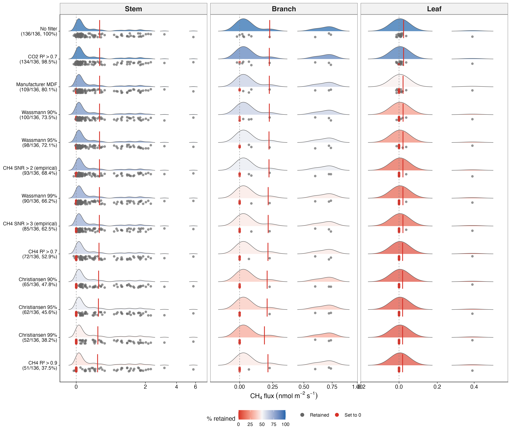{#fig-component-ridges width=90%}

Stem < 2 m fluxes---the largest component (~1.0 nmol m^-2^ s^-1^)---varied by only 7% across all filter definitions (CV = 2.2%). Leaf fluxes were the most sensitive component (range 78--100%, CV = 9.0% with outliers retained). A clear hierarchy emerges: filter choice matters in proportion to how close a component's flux is to the detection limit.

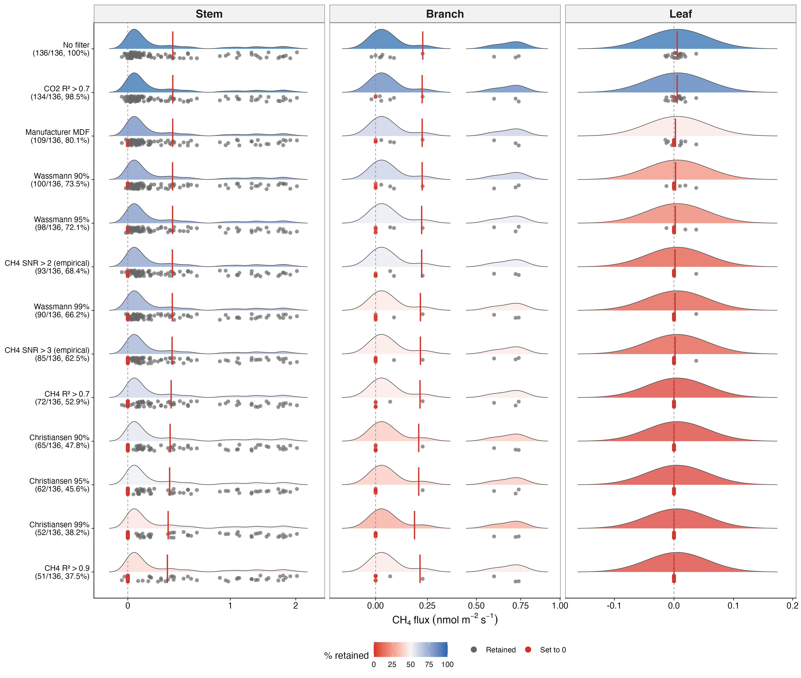{#fig-component-no-outliers width=90%}

## Sensitivity of the stand-level budget

Despite the variable sensitivity of individual components, the integrated stand-level CH~4~ budget was remarkably stable across filter definitions (@fig-budget). With outliers retained, the total budget ranged from 0.692 to 0.582 nmol m^-2^ ground s^-1^ (maximum reduction of 16%). Outlier removal was more consequential for the integrated budget than the choice of detection methodology.

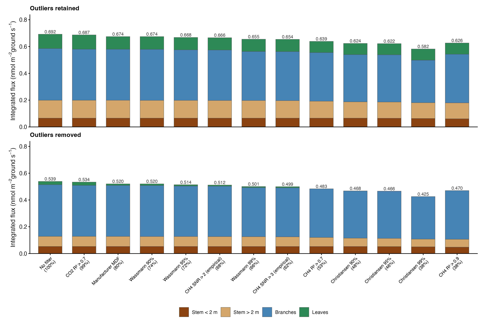{#fig-budget width=90%}

## R^2^ as a detection metric, not a quality filter {#sec-r2}

R^2^ measures how well a model fits the concentration timeseries, which is a function of both the flux magnitude and the instrument noise. Two measurements with the same instrument noise but different true fluxes will have different R^2^ values; the larger flux always produces a higher R^2^. This means R^2^ filters preferentially retain high-flux measurements and systematically exclude low emitters.

Critically, R^2^ filters do not merely bias toward high-flux measurements---they bias toward high-flux *conditions*. @fig-r2-flux demonstrates this directly: R^2^ is strongly correlated with both flux magnitude and air temperature. Low-R^2^ measurements are systematically colder and lower-flux. An R^2^ threshold will preferentially retain measurements made during warm, biologically active periods and preferentially exclude measurements from cold, dormant periods when fluxes are genuinely small.

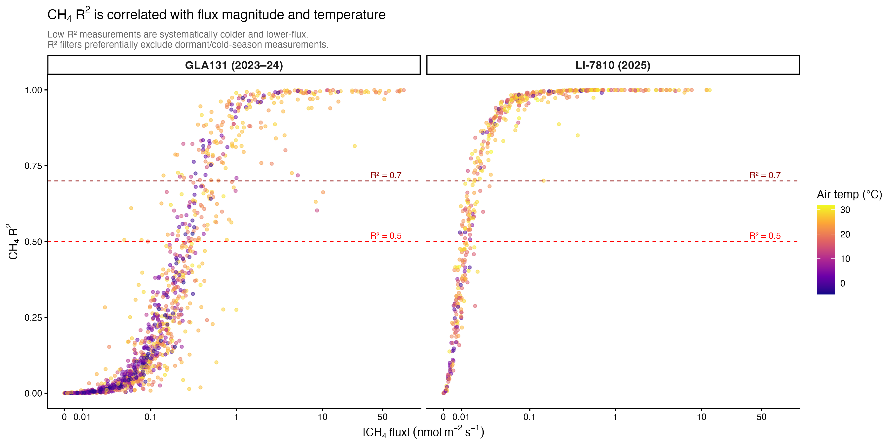{#fig-r2-flux width=95%}

@fig-seasonal-frac quantifies this seasonal structure: in dormant months (Nov--Apr), 88--93% of measurements fail R^2^ > 0.5 or R^2^ > 0.7 thresholds, compared to 52--61% in the growing season. Even MDF-based filters show elevated dormant-season exclusion (67% vs. 39% for Christiansen 95%). This structured exclusion is not a noise correction---it removes a biologically real state from the dataset.

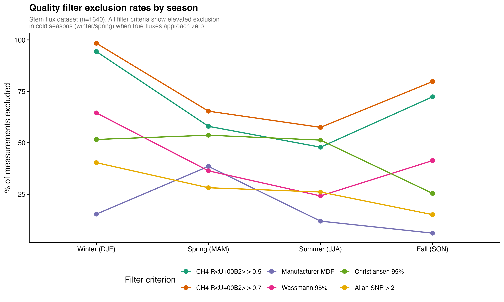{#fig-seasonal-frac width=90%}

@fig-timeseries shows the temporal distribution of measurements classified by filter status. Excluded measurements (red tones) cluster in dormant months, not randomly in time, confirming the structured nature of the exclusion.

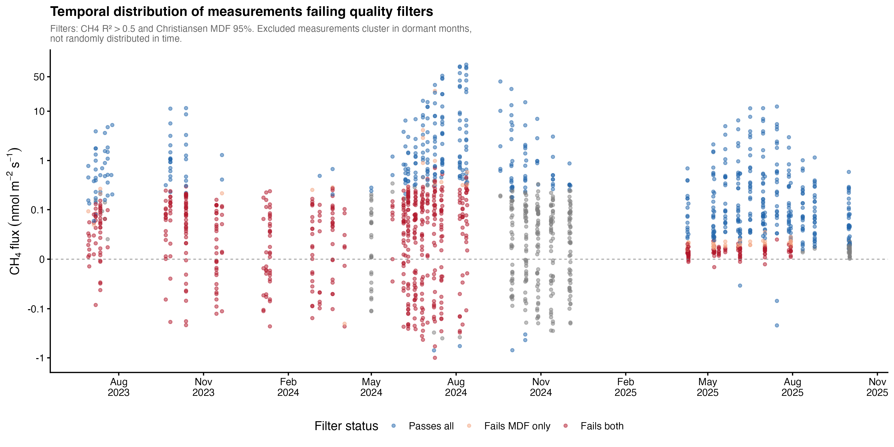{#fig-timeseries width=95%}

@fig-flux-temp provides a direct demonstration of the ecological confounding: excluded measurements cluster at low temperatures, not randomly across the temperature range.

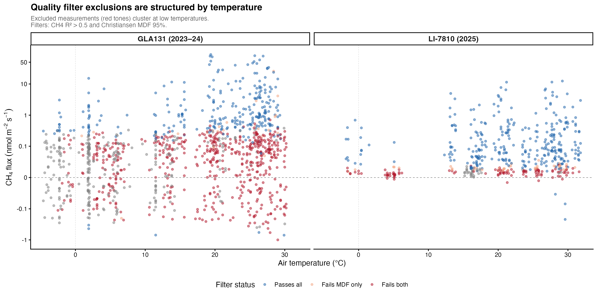{#fig-flux-temp width=95%}

## Question-dependent filtering recommendations

The sensitivity analysis reveals that no single filtering approach is universally optimal. The appropriate treatment depends on the scientific question (@tbl-recommendations).

| Question / goal | Below-MDF treatment | Appropriate filters |
|:---|:---|:---|
| Mean flux / budgets / scaling | Keep original + flag | Hard QC only |
| Seasonal / spatial patterns | Keep original + flag | Hard QC; report fraction below MDF |
| Is this flux nonzero? | Remove below MDF | Christiansen MDF 90/95/99% |
| Is this a source or sink? | Remove below MDF | Christiansen + sign test |
| Model fitting / drivers | Remove below MDF | Report selection; consider censored regression |
| Cross-study comparison | Report all three | Show sensitivity |

: Question-dependent filtering recommendations. {#tbl-recommendations}

\newpage

# Treatment of below-detection measurements

## Statistical consequences of the three treatments

Across seven MDF thresholds applied to the Harvard Forest stem monitoring dataset (n = 1,640), the three below-MDF treatments produced markedly different outcomes for both the mean and median CH~4~ flux (@fig-treatment-ridges, @fig-treatment-bias).

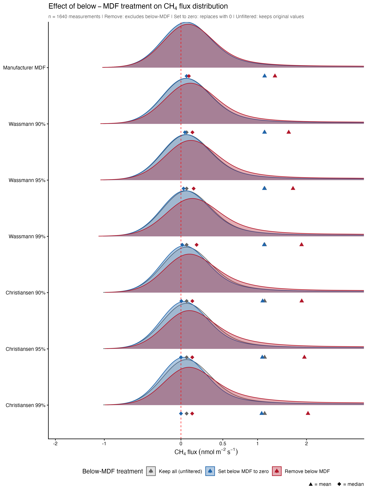{#fig-treatment-ridges width=90%}

Removing below-MDF measurements shifted the mean flux upward by 17% (Manufacturer MDF) to 135% (Christiansen 99%) relative to the unfiltered baseline. The median was even more severely affected: +40% to +319%. Setting below-MDF measurements to zero changed the mean by less than 5%, but the median dropped toward zero. Retaining all measurements at their original values---flagging but not modifying those below detection---is the only treatment that preserves both the mean and median.

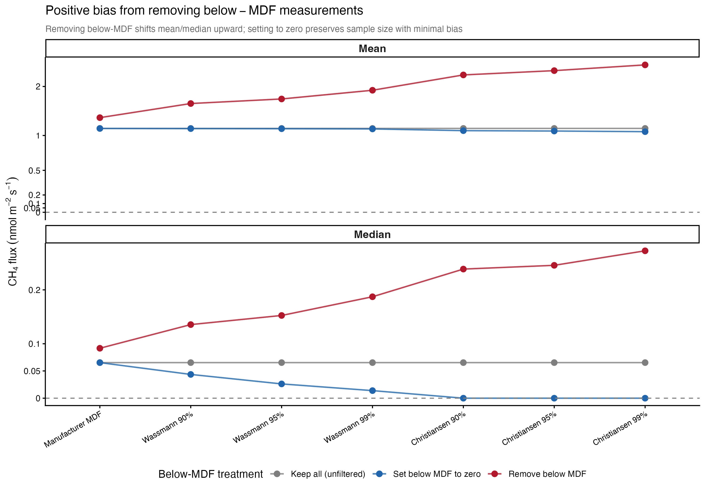{#fig-treatment-bias width=85%}

## Instrument-dependence of the removal bias

The treatment effect was almost entirely confined to the GLA131 (@fig-treatment-inst). For the LI-7810, all three treatments produced nearly indistinguishable distributions at every MDF threshold. This demonstrates that the removal bias is driven by instrument noise, not by the biological flux distribution.

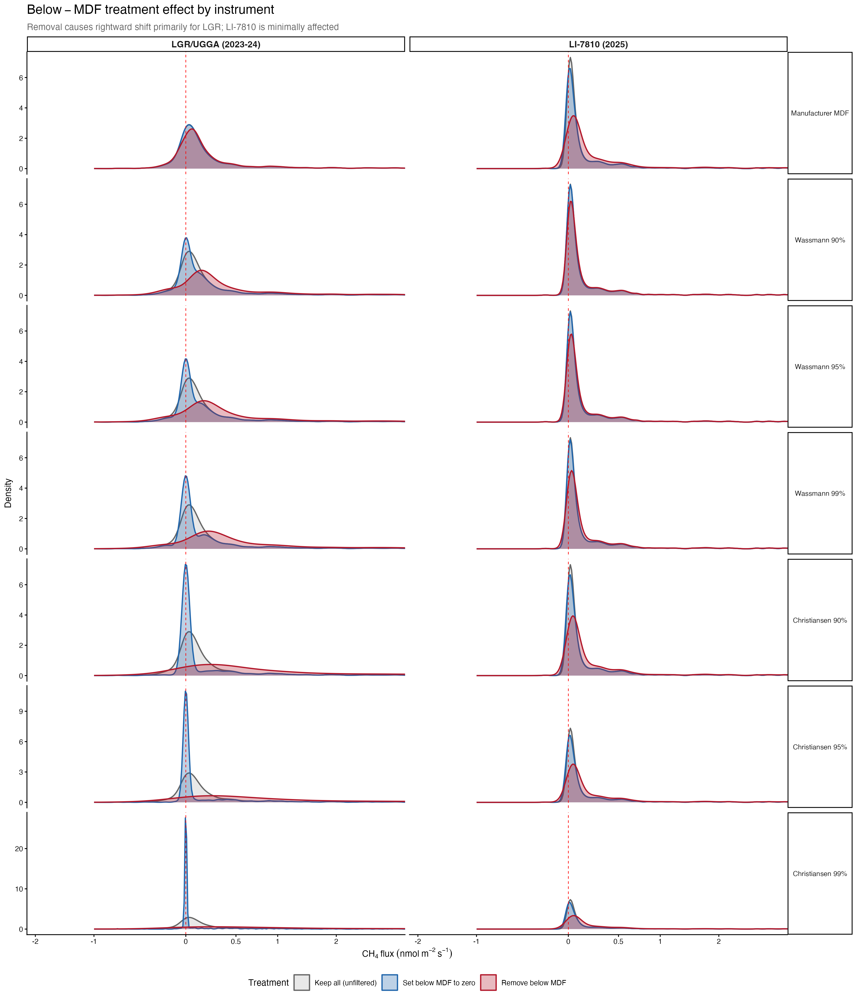{#fig-treatment-inst width=90%}

## Cumulative annual budget under different treatments

@fig-cumulative demonstrates how filter-induced bias accumulates over an annual cycle. Using GLA131 stem data from calendar year 2024 (all 12 months), the cumulative annual flux estimate under removal treatments (R^2^ > 0.5 or Christiansen 95%) diverges progressively from the unfiltered baseline, with the gap widening through dormant months when exclusion rates are highest. The R^2^-filtered estimate inflated the annual total by 91%.

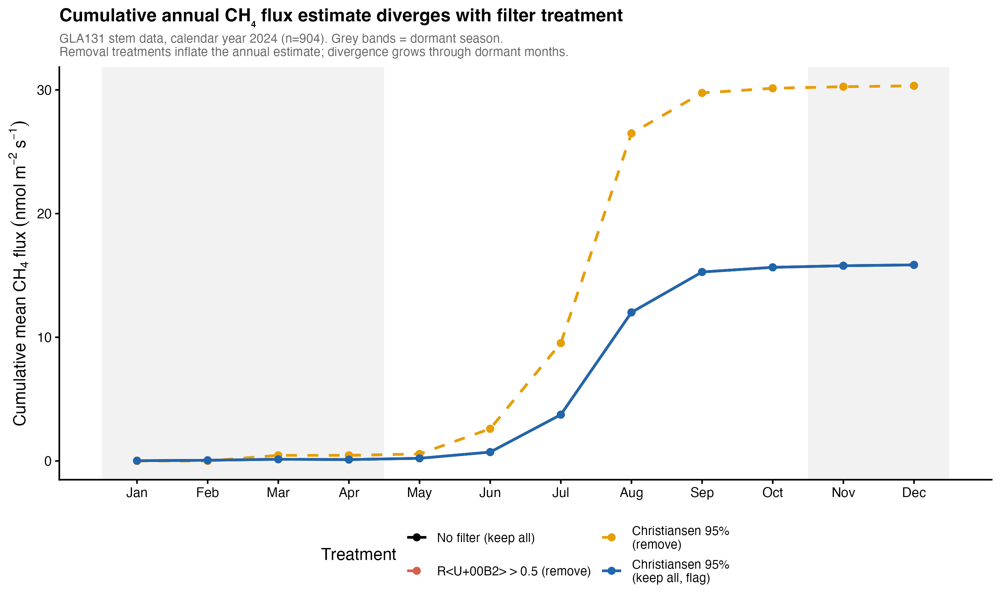{#fig-cumulative width=90%}

\newpage

# Data transformation {#sec-transformation}

## The problem with log transformation

The log transformation is the most common variance-stabilizing transformation in ecology. However, the log of a non-positive number is undefined, and applying a log transform to CH~4~ flux data silently drops all zero and negative values. The data loss is not merely a sample size issue---it is a systematic bias. The dropped values are concentrated at the low end of the flux distribution, where both near-zero emissions and true uptake occur (@fig-transform).

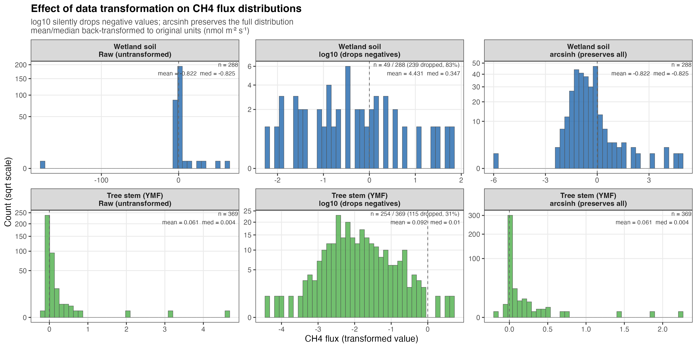{#fig-transform width=95%}

## The arcsinh transformation

The inverse hyperbolic sine, arcsinh($x$) = ln($x + \sqrt{x^2 + 1}$), provides a variance-stabilizing transformation that handles the full real line (@fig-arcsinh). Its key properties for flux data are: (1) defined for all real numbers; (2) approximately linear near zero; (3) approximately logarithmic for large $|x|$; (4) smooth transition with no threshold to specify; (5) symmetric---arcsinh($-x$) = $-$arcsinh($x$).

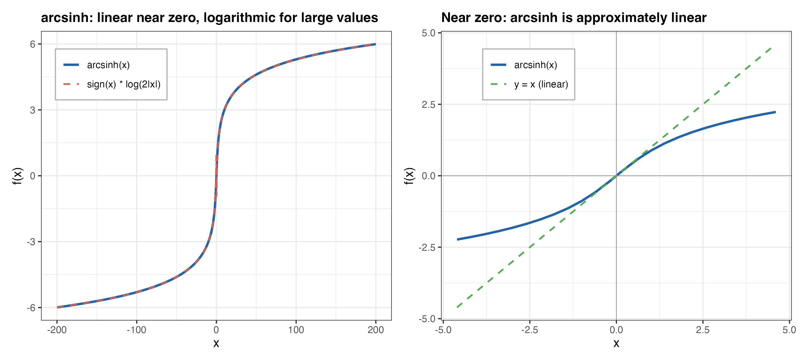{#fig-arcsinh width=85%}

## Empirical comparison

For the wetland soil dataset, the raw distribution is strongly left-skewed (Shapiro-Wilk W = 0.15, p < 10^-33^). The log~10~ transform produces a roughly normal distribution (W = 0.97, p = 0.33) but retains only 17% of the data. The arcsinh transform retains all 288 values and substantially improves symmetry (W = 0.83, p < 10^-16^)---not perfectly normal, but far more tractable than the raw data (@fig-qq).

Across the three datasets, raw variance spans a 1,334-fold range. After arcsinh transformation, the variance ratio drops to 29-fold.

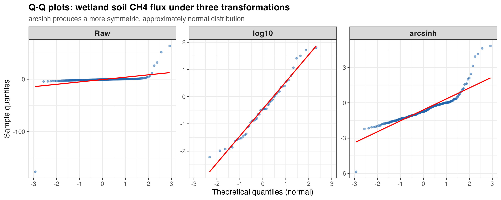{#fig-qq width=90%}

## Practical recommendations for statistical analysis

- **Arcsinh for visualization and variance stabilization.** Use arcsinh-scaled axes for plotting and as a transformation for model fitting.
- **Non-parametric methods for group comparisons.** Wilcoxon rank-sum tests, Kruskal-Wallis, and permutation tests.
- **Bootstrapped confidence intervals** for means used in scaling.
- **GLMs/GLMMs for regression.** Gaussian GLMs with identity link on arcsinh-transformed data. When a large fraction falls below detection, use censored regression (Tobit-style).
- **If log-transforming, report data loss explicitly.**

\newpage

# Synthesis and recommendations

The analyses above document a processing pipeline in which each choice feeds into the next and errors compound downstream. Relying on manufacturer precision specifications inflates detection rates by underestimating the noise floor of noisier instruments. Conservative MDF methods, when combined with removal of below-detection values, can inflate reported mean fluxes by more than 100%. Log transformation then discards the near-zero and negative values that survived both previous steps, compounding the upward bias further.

The key unifying principle is that the appropriate processing choice depends on the scientific question. For population estimates and budget calculations, preserving all measurements is essential. For detection and sign questions, filtering to the confidently-detected subset is appropriate. These two objectives are genuinely different and require genuinely different treatments.

A further dimension---not fully captured by noise-based framing---is that near-zero fluxes arise from two distinct sources: instrument noise and genuine biological suppression. Quality filters based on R^2^, SNR, or MDF cannot distinguish between these sources. As demonstrated in @fig-seasonal-frac and @fig-flux-temp, the consequence is seasonally structured exclusion that preferentially removes dormant-season measurements, inflating annual budget estimates by up to 91% (@fig-cumulative).

## Reporting checklist

We recommend that authors report at minimum:

1. Instrument model and manufacturer precision specification
2. Empirical precision estimate (method and value)
3. Total number of measurements
4. Fraction below MDF (specify method and confidence level)
5. Quality filter(s) applied
6. Below-MDF treatment (remove, zero, or flag)
7. Transformation used
8. Outlier criteria, if any

# Conclusions

Chamber CH~4~ flux data processing involves a sequence of choices---precision estimation, detection limit calculation, quality filtering, below-detection treatment, and data transformation---each of which introduces predictable, quantifiable bias if handled carelessly. Manufacturer precision specifications are unreliable substitutes for empirical estimates and can underestimate real instrument noise by up to fourfold or more. The choice of detection threshold matters less than what is done with the measurements that fall below it: removing below-detection values inflates reported means by 17--135% and medians by 40--319%, while retaining original values with a detection flag preserves both statistics. The log transformation silently discards 10--83% of measurements; the arcsinh transformation is a direct replacement that handles negative values, stabilizes variance, and introduces no data loss. These processing choices interact and compound: R^2^ and MDF filters preferentially exclude dormant-season measurements, and removal of those measurements inflates annual budgets by up to 91%. We recommend a question-dependent framework with explicit reporting of processing choices to support cross-study comparability.

\newpage

# References {.unnumbered}

::: {#refs}
:::
