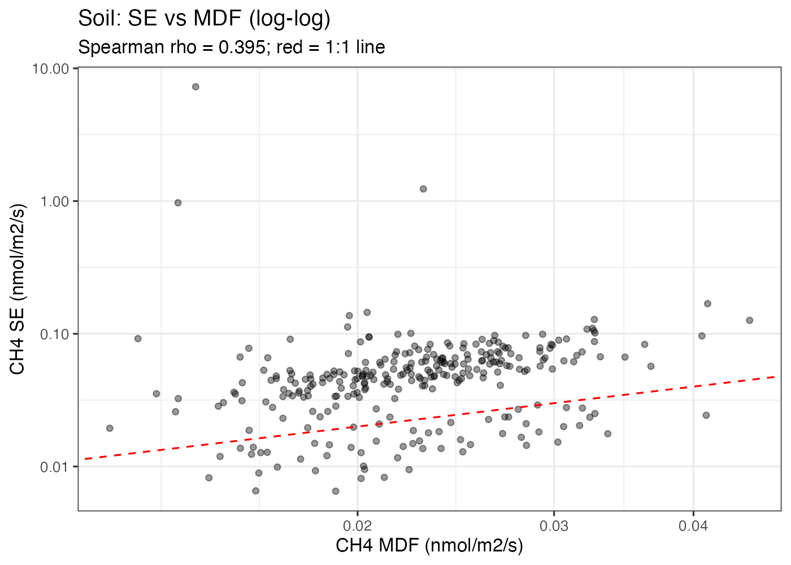

<!-- Note: Figure paths are relative to the manuscript/ directory -->

# Abstract

Chamber-based CH~4~ flux measurements increasingly capture ecosystem components whose fluxes are small, near-detection, or intermittently negative, making data processing choices consequential for reported results. Researchers processing such data face a sequence of largely unconsidered decisions: how to estimate instrument detection limits, which measurements to retain, what to do with below-detection values, and how to transform data for statistical analysis. Each choice interacts with the others, and errors compound downstream. We address each issue empirically using chamber CH~4~ flux datasets from Harvard Forest and Yale-Myers Forest, spanning ecosystem components with very different flux magnitudes and negative-value prevalence. Empirical CH~4~ precision estimated from the continuous analyzer timeseries differed substantially from manufacturer specifications, with discrepancies ranging from four-fold worse to better-than-spec across instruments; this variation propagated directly into detection limit calculations, with three published minimal detectable flux (MDF) methods flagging 20--62% of measurements as below detection depending on the precision estimate and confidence level used. Critically, removing below-detection measurements from the dataset inflated the mean flux by 17--135% and the median by 40--319% relative to the unfiltered baseline, with bias scaling monotonically with filter stringency; retaining original values and flagging detection status is the only treatment that preserves both statistics. Finally, the log transformation commonly applied to flux data silently drops 31--83% of measurements across ecosystem types because it cannot accommodate negative values, introducing a systematic upward bias; the arcsinh transformation is a direct replacement that handles negative values, stabilizes variance across components, and introduces no data loss. We provide question-dependent recommendations for each processing step and a reporting checklist to support cross-study comparability.

\newpage

# Introduction

Chamber-based measurements of CH~4~ flux are used across a broad range of ecosystem components, from wetland soils with large, temporally variable emissions to tree stems, branches, and leaves whose fluxes are often small and close to the detection limit of field-deployable analyzers. The methodological literature has devoted considerable attention to the design of chamber systems, the selection of flux-fitting models, and the appropriate temporal resolution of measurements. Comparatively little attention has been paid to the sequence of data processing choices that follow raw flux computation: how to characterize instrument precision and set detection thresholds, which measurements to retain or discard, how to treat measurements that fall below detection, and how to transform flux distributions for statistical analysis.

These choices are not merely technical details. Each step in the processing pipeline introduces potential bias, and the choices interact: an overly conservative detection limit combined with removal of below-detection values and log transformation of the remainder compounds three independent sources of positive bias into the reported flux estimate. The magnitude of these biases depends on the fraction of measurements near detection---which in turn depends on the true flux magnitude, the instrument precision, and the chamber geometry---but can reach or exceed 100% of the true flux for small-flux components such as leaf or dormant-season stem emissions.

Three interconnected issues motivate this paper. First, minimal detectable flux (MDF) calculations require a precision estimate, and manufacturer specifications are routinely used as a convenient default. We show that empirical precision estimated from the analyzer timeseries can differ substantially from the datasheet value in either direction, and that this discrepancy propagates directly into detection thresholds and the fraction of measurements flagged as below detection. Second, quality filtering involves two distinct choices that are often conflated: the choice of detection criterion and the treatment of measurements that fail it. We show that the treatment---whether to remove below-detection measurements, set them to zero, or retain them with a flag---is more consequential for reported means and medians than the choice of detection threshold itself. Third, the log transformation applied to flux data for variance stabilization and normalization silently discards negative values, which are common in mixed-sign distributions such as those from methanotrophic soils or near-detection stem fluxes; the arcsinh transformation provides a drop-in replacement that handles the full real line without data loss.

We address each issue empirically using chamber CH~4~ flux datasets from Harvard Forest and Yale-Myers Forest, spanning ecosystem components with very different flux magnitudes and negative-value prevalence. Our goal is not to prescribe a single processing protocol, but to document the consequences of each choice and provide question-dependent recommendations that allow researchers to select the approach appropriate for their scientific objective.

# Methods

## Study sites and datasets

[Full site descriptions for Harvard Forest and Yale-Myers Forest to be added here.] Three datasets are used throughout this analysis. The Harvard Forest stem monitoring dataset (n = 1,640 measurements) comprises stem flux measurements from 2023--2024 using Analyzer A (n = 1,142) and 2025 using Analyzer B (n = 498); this dataset is used for precision estimation, MDF analysis, treatment comparison, and seasonal confounding analysis. The Harvard Forest canopy dataset (n = 136 measurements across stem, branch, and leaf tissues) sampled using three individual Analyzer A units (A-1, A-2, A-3) provides multi-instrument precision comparisons. The Yale-Myers Forest datasets include stem flux measurements (n = 369) and wetland soil flux measurements (n = 288) collected with Analyzer A instruments; these are used for the data transformation comparison (@sec-transformation) and as a second site for seasonal confounding analysis.

## Instruments and chamber geometry

The Harvard Forest stem monitoring dataset used two off-axis integrated cavity output spectroscopy (OA-ICOS) analyzers (ABB GLA131-series Microportable Greenhouse Gas Analyzers, hereafter **Analyzer A**) in 2023--2024 and a cavity ring-down spectrometer (LI-COR LI-7810, hereafter **Analyzer B**) in 2025. The Harvard Forest canopy dataset used three individual GLA131 units (referred to as units A-1, A-2, and A-3). Throughout this paper and in all figures we refer to these instruments by their anonymous designations. This choice is deliberate: the two analyzer types differed in their real-world realized precision due to differences in service history and cumulative field use, not inherent instrument quality. One had been serviced more recently; the other had experienced some performance degradation over its deployment period. The comparison is therefore a case study of two instruments with different realized noise floors, not an evaluation of manufacturer or analyzer design. Readers interested in head-to-head instrument specifications should consult the relevant manufacturer documentation and independent intercomparison studies.

Analyzer A reports dry-mole-fraction CH~4~ and CO~2~ at 1 Hz with manufacturer-specified CH~4~ precision of 0.9 ppb and CO~2~ precision of 0.35 ppm (1-sigma at 1 s averaging). Analyzer B reports at 1 Hz with manufacturer-specified CH~4~ precision of 0.6 ppb (1-sigma at 1 s).

All stem measurements used permanent collars with radius 5.08 cm (surface area = 0.00811 m^2^). Chamber volume was computed from measured tree diameters and collar depth for each tree, with an additional 0.028 L for connecting tubing. The flux term---encoding ambient pressure, chamber volume, surface area, and temperature via the ideal gas law---was computed per measurement using the goFlux R package.

## Empirical precision estimation

### Allan deviation (per-measurement)

For each flux measurement, we estimated Allan deviation at $\tau$ = 1 s from the dry-mole-fraction timeseries within the measurement window. Because concentrations change monotonically during a chamber closure, the flux-driven trend was removed by first-differencing before estimating noise, yielding a measurement-specific precision estimate that is independent of the flux model fit.

### Rolling window scan (per-instrument)

We scanned the full continuous timeseries for each instrument using a 30-second rolling window. For each window we computed the absolute slope (via linear regression) and the residual standard deviation around the fit. Windows were ranked by a combined normalized score of |slope| + residual SD; the bottom 5% (flattest and quietest) were selected as representative of the true instrument noise floor. This yields a single global precision estimate per instrument that is used in the Wassmann MDF calculation (@sec-mdf).

### Model-fit standard error

Flux computation packages such as goFlux report a standard error (SE) of the slope from the fitted model (linear or Hutchinson-Mosier), propagated through the flux-term conversion to flux units. This model-fit SE is a per-measurement uncertainty metric distinct from both the Allan deviation and the standard error of the mean used for population-level estimates: it reflects the goodness of fit of the concentration model to a single closure rather than the instrument noise floor or the spread of fluxes across measurements.

## Minimal detectable flux (MDF) calculation approaches {#sec-mdf}

We computed MDF using three published approaches, all sharing the general form:

$$\text{MDF} = \frac{\text{precision\_term}}{t} \times \text{flux\_term}$$

where $t$ is measurement duration in seconds and flux\_term encodes chamber volume-to-area ratio and temperature via the ideal gas law, computed per measurement by goFlux. The three approaches differ in their precision term and confidence scaling:

- **Manufacturer MDF (goFlux).** Uses the Analyzer A datasheet precision (0.9 ppb CH~4~): $\text{MDF} = \text{precision}_\text{manufacturer} / t \times \text{flux\_term}$.

- **Wassmann et al. (2018).** Uses the global empirical precision from the rolling window method, scaled for the desired confidence level: $\text{MDF} = (z \times \text{SD}_\text{global}) / t \times \text{flux\_term}$, where $z$ = 2.576, 1.960, or 1.645 for 99%, 95%, and 90% confidence respectively.

- **Christiansen et al. (2015) MQL variant.** Uses the per-measurement Allan deviation, a factor of 3, and the t-distribution critical value: $\text{MDF} = (\text{SD}_\text{Allan} \times 3 \times t_\text{crit}) / t \times \text{flux\_term}$, where $t_\text{crit}$ is the two-tailed t critical value at the specified confidence level with df = $t - 2$. Computed at 99%, 95%, and 90% confidence.

The relationship between MDF and measurement duration is illustrated in @fig-detection-limits (panel c).

## Additional quality filter criteria

Beyond MDF, we evaluated several additional quality filters commonly applied to chamber flux data:

- **CH~4~ R^2^ thresholds (> 0.7, > 0.9):** Coefficient of determination from the best-fit model (linear or Hutchinson-Mosier, as selected by goFlux).
- **CO~2~ R^2^ threshold (> 0.7):** Applied to the concurrent CO~2~ flux from the same measurement as an independent check on measurement quality.
- **Signal-to-noise ratio (SNR) thresholds (> 2, > 3):** Defined as |CH~4~ flux| / noise\_floor, where noise\_floor = $\sigma_\text{Allan} / t \times \text{flux\_term}$ converts the per-measurement Allan deviation to flux units.

## Seasonal confounding analysis

To assess whether quality filters introduce structured temporal bias, we computed the fraction of measurements excluded by each criterion as a function of calendar month, season (dormant: Nov--Apr; growing: May--Oct), and 10 °C air temperature bins. We applied this analysis to both the Harvard Forest stem monitoring dataset (n = 1,640) and the Yale-Myers Forest wetland soil dataset (n = 288) to test generality across measurement types with different flux regimes.

## Below-MDF treatment comparison

For each of seven MDF thresholds (Manufacturer, Wassmann 90/95/99%, Christiansen 90/95/99%), we applied three treatments to measurements flagged as below detection: (1) **Remove:** exclude below-MDF measurements from the dataset entirely; (2) **Set to zero:** replace below-MDF flux values with zero, preserving sample size; and (3) **Keep original (flag only):** retain all measured flux values and flag each measurement as above or below its per-measurement MDF.

## Data transformations

We compared three transformations---raw (untransformed), log~10~, and arcsinh---across two datasets spanning a range of negative-flux prevalence: wetland soil (83% negative) and tree stem (31% negative). For each transformation we report data retention, the Shapiro-Wilk W statistic, and the variance ratio across datasets.

\newpage

# Detection limits {#sec-detection}

## Empirical precision vs. manufacturer specification

Empirical CH~4~ precision varied substantially across instruments and estimation methods (@fig-detection-limits, panel a). For unit A-1, the median Allan deviation (3.6 ppb) was four times the manufacturer specification (0.9 ppb), and the rolling window estimate (2.5 ppb) was nearly three times the specification. Unit A-3 showed a more moderate discrepancy (Allan deviation 1.5 ppb, rolling window 1.2 ppb). Unit A-2 was the exception: both empirical estimates (Allan deviation 0.6 ppb, rolling window 0.7 ppb) were better than the datasheet value.

In the multi-instrument stem monitoring dataset, the Analyzer A median Allan deviation across 1,206 measurements was 4.0 ppb (IQR: 3.2--4.9 ppb), 4.4$\times$ worse than the manufacturer specification. The Analyzer B median was 0.095 ppb (IQR: 0.086--0.108 ppb), 6.3$\times$ better than its specification, with a remarkably tight distribution spanning less than a factor of 1.3 across the interquartile range (@fig-detection-limits, panel b).

## Consequences for MDF thresholds and detection rates

The three MDF approaches produced detection thresholds spanning roughly an order of magnitude for CH~4~ (Figure S16, @fig-detection-limits panel d). The manufacturer-based MDF was the most permissive for canopy data, flagging 20% of CH~4~ measurements as below detection. Wassmann thresholds (which substitute empirical global precision for the datasheet value) flagged 26--34%, depending on confidence level. The Christiansen approach---which combines per-measurement Allan deviation with a factor of 3 and a t-distribution critical value---was the most conservative, flagging 52--62% as below detection.

In the multi-instrument stem dataset, instrument-specific Wassmann global SDs (Analyzer A: 4.0 ppb, Analyzer B: 0.095 ppb) produced thresholds roughly 40$\times$ higher for Analyzer A measurements. Consequently, Wassmann 99% flagged 52% of Analyzer A measurements but only 15% of Analyzer B measurements as below detection (@fig-detection-limits, panel d).

{#fig-detection-limits width=95%}

## Model-fit SE as a complementary detection metric

The MDF-based detection framework characterizes whether a flux is distinguishable from zero based on the instrument noise floor. An alternative approach uses the model-fit standard error reported by goFlux (§2.3): the ratio |flux| / SE is a t-statistic that directly tests whether the estimated flux slope differs from zero. SE-based detection is conceptually complementary to MDF-based detection: MDF asks whether the flux exceeds the theoretical noise floor, while SE asks whether the fitted model constrains the flux with sufficient precision.

We evaluated this comparison using the wetland soil dataset (n = 288), where goFlux reports both LM.SE and HM.SE alongside per-measurement MDF. SE-based and MDF-based signal-to-noise ratios (|flux| / SE and |flux| / MDF, respectively) were strongly correlated (Spearman $\rho$ = 0.90; @fig-se-mdf). At common detection thresholds (SNR > 2 and SNR > 3), the two metrics disagreed on only 3.8--5.6% of measurements. The model-fit SE was consistently larger than MDF by a factor of ~2.2, making SE-based detection modestly more conservative.

The agreement between SE and MDF is reassuring but not guaranteed. SE incorporates the actual model fit quality---a measurement with instrument noise within specification but a poorly-fitting concentration model (e.g., due to non-linear diffusion effects or transient disturbances) will have a large SE even if MDF is small. Conversely, SE depends on the flux model choice (linear vs. Hutchinson-Mosier) and on whether the processing pipeline propagates units correctly through the SE calculation. We recommend reporting SE-based SNR alongside MDF-based metrics where available, but caution against using SE as a standalone filter criterion without first verifying that it tracks the instrument noise floor for the specific dataset and processing pipeline.

{#fig-se-mdf width=75%}

## Negative fluxes: noise or biology?

The stem flux dataset contained 284 negative CH~4~ flux measurements (17.3% of 1,640), distributed asymmetrically between analyzers: 275/1,142 (24.1%) for Analyzer A vs. 9/498 (1.8%) for Analyzer B. Three lines of evidence indicate that the majority of Analyzer A negative fluxes reflect instrument noise rather than biological CH~4~ uptake:

- **Apples-to-apples seasonal comparison.** Restricting the comparison to overlapping calendar months (June--October), Analyzer A still showed 20.3% negative fluxes (169/832) vs. 1.7% (6/353) for Analyzer B---same trees, same season, same chambers.

- **Noise floor analysis.** Of 246 Analyzer A negative fluxes with Allan deviation estimates, 52% had absolute values within 1$\sigma$ of the per-measurement noise floor, 74% within 2$\sigma$, and 84% within 3$\sigma$ (Figure S27).

- **Distribution shape.** On Analyzer A, the near-zero flux distribution was roughly symmetric around a small positive value, consistent with Gaussian noise broadening a weakly positive signal. On Analyzer B, the same trees resolved as a tight, positively-skewed distribution with almost no negative tail.

\newpage

# Quality filtering

## Two distinct quality questions

Quality filtering of chamber flux data conflates two genuinely distinct questions that require different tools and different logic. The first is a question of **measurement validity:** was this closure conducted correctly, with no leaks, equipment malfunctions, or procedural errors? The second is a question of **signal detectability:** was the flux large enough relative to instrument noise to be distinguishable from zero? These are independent. A perfectly valid closure can yield a below-detection flux. A corrupted closure can produce a concentration change that passes every statistical detection criterion.

## Assessing measurement validity

The most useful diagnostic for detecting invalid closures is CO~2~ flux as a process tracer for live tissue. Live respiring tissue must produce a positive CO~2~ flux; a zero or negative CO~2~ rate is strong evidence of a seal failure, collapsed chamber, or dead tissue. A critical limitation of R^2^-based validity checks is that a constant leak produces a perfectly linear concentration change---indistinguishable from a real flux by R^2^ alone.

@fig-co2-validity illustrates four stem chamber closures that demonstrate how CO~2~ can help distinguish measurement validity from signal detectability---while also highlighting the limits of this approach. Panel (a) shows a high-signal measurement: both CO~2~ and CH~4~ concentrations increase linearly (CO~2~ R^2^ = 0.99, CH~4~ R^2^ = 1.00), confirming a valid closure with a strong CH~4~ source. Panel (b) shows a valid closure with a noisy but directional CH~4~ flux: the CO~2~ trace confirms a good seal (R^2^ = 0.99), but the CH~4~ concentration shows only a weak trend buried in noise (R^2^ = 0.21). This measurement would fail any standard R^2^ filter, yet the CO~2~ diagnostic confirms it is a valid measurement of a real---if noisy---CH~4~ uptake signal. Panel (c) shows a genuinely invalid measurement: both gases are flat (CO~2~ R^2^ = 0.04, CH~4~ R^2^ = 0.05), indicating a seal failure or equipment malfunction. Panel (d) is the most ambiguous case: the CO~2~ trace is flat (R^2^ = 0.004), yet the CH~4~ trace shows a plausible-looking linear increase (R^2^ = 0.97). Without the CO~2~ check, this measurement would pass any CH~4~-based quality filter. This panel comes from the same tree (*Nyssa sylvatica*, wetland) that produced the dataset's highest CH~4~ flux (panel a). The flat CO~2~ could indicate a failed closure---in which case the apparent CH~4~ signal reflects ambient variability or a slow leak---or it could reflect genuine biological decoupling, with CH~4~ venting from the stem while CO~2~ efflux is suppressed. Resolving this ambiguity requires ecological context: knowledge of the season, tissue activity, and measurement conditions.

However, CO~2~ cannot always serve as a reliable validity diagnostic. Biological decoupling between CO~2~ and CH~4~ is common: some stems may produce substantial CH~4~ flux with minimal CO~2~ efflux if respiration rates are low relative to methanogenic activity, or if CO~2~ is consumed by internal dissolution or bark photosynthesis. Conversely, CO~2~ efflux may be suppressed at low temperatures even when dissolved CH~4~ continues to vent passively. A low CO~2~ signal therefore does not always indicate a failed closure---it may reflect genuine physiology. Using CO~2~ as a blanket quality filter risks discarding valid measurements from metabolically quiescent tissue. The diagnostic is most informative for tissue that is known to be actively respiring (e.g., growing-season stem measurements on live trees), and less reliable for dormant tissue, dead wood, or soil surfaces where CO~2~ production may be decoupled from the target gas.

![Raw concentration timeseries for four example chamber closures. Top row: CO~2~ (ppm); bottom row: CH~4~ (ppb). Green-tinted panels (a, b) have valid CO~2~ signals confirming good closures; red-tinted panels (c, d) have flat CO~2~, indicating failed or ambiguous closures. Panel (d) illustrates why CH~4~ quality metrics alone are insufficient: the CH~4~ trace appears well-constrained (R^2^ = 0.97) despite the failed closure. However, CO~2~ is not infallible---genuine biological decoupling between CO~2~ and CH~4~ can produce valid measurements with low CO~2~ signal.](../figures/co2_validity_examples.png){#fig-co2-validity width=95%}

## R^2^ as a detection metric, not a quality filter {#sec-r2}

R^2^ measures how well a model fits the concentration timeseries, which is a function of both the flux magnitude and the instrument noise. Two measurements with the same instrument noise but different true fluxes will have different R^2^ values; the larger flux always produces a higher R^2^. This means R^2^ filters preferentially retain high-flux measurements and systematically exclude low emitters.

Critically, R^2^ filters do not merely bias toward high-flux measurements---they bias toward high-flux *conditions*. @fig-r2-flux demonstrates this directly: R^2^ is strongly correlated with both flux magnitude and air temperature in both stem data (panel a) and soil data (panel b). Low-R^2^ measurements are systematically colder and lower-flux. An R^2^ threshold will preferentially retain measurements made during warm, biologically active periods and preferentially exclude measurements from cold, dormant periods when fluxes are genuinely small.

Plotting the signed flux (Figures S17, S18) reveals additional structure: negative fluxes cluster almost entirely below the R^2^ = 0.5 threshold, meaning that R^2^ filters preferentially remove not just small fluxes but specifically the near-zero and negative values that are most informative about whether a measurement point is a source or sink.

{#fig-r2-flux width=95%}

@fig-seasonal-exclusion quantifies this seasonal structure for both datasets. In the stem data (panel a), dormant-month (Nov--Apr) exclusion rates reach 88--93% for R^2^ > 0.5 or R^2^ > 0.7 thresholds, compared to 52--61% in the growing season. Even MDF-based filters show elevated dormant-season exclusion (67% vs. 39% for Christiansen 95%). Binning by air temperature (panel b) confirms that the pattern is driven by temperature rather than calendar date: exclusion rates for R^2^ filters increase monotonically from ~49% in the warmest bin (20--30 °C) to ~80% in the coldest (-10--0 °C), while MDF-based filters show a weaker but still structured temperature dependence. This structured exclusion is not a noise correction---it removes a biologically real state from the dataset. Temporal distributions (Figures S21, S22) confirm that excluded measurements cluster in dormant months and at low temperatures, not randomly in time or across the temperature range.

### Seasonal confounding in the wetland soil dataset

The same seasonal confounding pattern is evident in the wetland soil dataset (n = 288, 83% negative), where MDF flags are unavailable but R^2^-based filters reproduce the structured exclusion. Dormant-season measurements are excluded at higher rates than growing-season measurements for all R^2^ thresholds (@fig-seasonal-exclusion, panels c--d), and low-R^2^ measurements are systematically colder and lower in flux magnitude (@fig-r2-flux, panel b). Excluded measurements cluster in cold months and at low chamber temperatures (Figures S23, S24), confirming that R^2^ filtering introduces the same ecologically correlated bias across measurement types. Temperature binning confirms the same monotonic pattern in the soil data, with R^2^ > 0.5 exclusion rates ranging from 12% in the warmest bin to 28% in the coldest (@fig-seasonal-exclusion, panel d).

The signed-flux view (Figure S18) is particularly revealing for the soil data: high-R^2^ measurements span the full flux range from strongly negative (CH~4~ uptake) to positive (emission), while low-R^2^ values cluster near zero where sign is ambiguous. An R^2^ filter thus removes the most ecologically interesting measurements---the transition zone between net uptake and net emission.

{#fig-seasonal-exclusion width=95%}

## Question-dependent filtering recommendations

The sensitivity analysis reveals that no single filtering approach is universally optimal. The appropriate treatment depends on the scientific question (@tbl-recommendations).

| Question / goal | Below-MDF treatment | Appropriate filters |
|:---|:---|:---|
| Mean flux / budgets / scaling | Keep original + flag | Hard QC only |
| Seasonal / spatial patterns | Keep original + flag | Hard QC; report fraction below MDF |
| Is this flux nonzero? | Remove below MDF | Christiansen MDF 90/95/99% |
| Is this a source or sink? | Remove below MDF | Christiansen + sign test |
| Model fitting / drivers | Remove below MDF | Report selection; consider censored regression |
| Cross-study comparison | Report all three | Show sensitivity |

: Question-dependent filtering recommendations. {#tbl-recommendations}

\newpage

# Treatment of below-detection measurements

## Statistical consequences of the three treatments

Across seven MDF thresholds applied to the Harvard Forest stem monitoring dataset (n = 1,640), the three below-MDF treatments produced markedly different outcomes for both the mean and median CH~4~ flux (@fig-treatment).

Removing below-MDF measurements shifted the mean flux upward by 17% (Manufacturer MDF) to 135% (Christiansen 99%) relative to the unfiltered baseline (@fig-treatment, panel a). The median was even more severely affected: +40% to +319% (panel b). Setting below-MDF measurements to zero changed the mean by less than 5%, but the median dropped toward zero. Retaining all measurements at their original values---flagging but not modifying those below detection---is the only treatment that preserves both the mean and median.

{#fig-treatment width=95%}

## Instrument-dependence of the removal bias

The treatment effect was almost entirely confined to Analyzer A (Figure S25). For Analyzer B, all three treatments produced nearly indistinguishable distributions at every MDF threshold. This demonstrates that the removal bias is driven by instrument noise, not by the biological flux distribution.

## Cumulative annual budget under different treatments

@fig-cumulative demonstrates how filter-induced bias accumulates over an annual cycle. Using Analyzer A stem data from calendar year 2024 (panel a), the cumulative annual flux estimate under removal treatments (R^2^ > 0.5 or Christiansen 95%) diverges progressively from the unfiltered baseline, with the gap widening through dormant months when exclusion rates are highest. The R^2^-filtered estimate inflated the annual total by 91%.

The same divergence pattern occurs in the wetland soil dataset (panel b), where R^2^ removal inflates the cumulative budget by 10--19% depending on threshold stringency. The bias direction is particularly notable here: the soil dataset is dominated by CH~4~ uptake (83% negative fluxes), so R^2^ removal makes the cumulative budget *more negative* by preferentially excluding near-zero dormant-season values. This confirms that R^2^ filtering biases the budget away from the true population mean regardless of the sign of the dominant flux.

{#fig-cumulative width=90%}

\newpage

# Data transformation {#sec-transformation}

## The problem with log transformation

The log transformation is the most common variance-stabilizing transformation in ecology. However, the log of a non-positive number is undefined, and applying a log transform to CH~4~ flux data silently drops all zero and negative values. The data loss is not merely a sample size issue---it is a systematic bias. The dropped values are concentrated at the low end of the flux distribution, where both near-zero emissions and true uptake occur (@fig-transform, panel a).

## The arcsinh transformation

The inverse hyperbolic sine, arcsinh($x$) = ln($x + \sqrt{x^2 + 1}$), provides a variance-stabilizing transformation that handles the full real line (@fig-transform, panel b). Its key properties for flux data are: (1) defined for all real numbers; (2) approximately linear near zero; (3) approximately logarithmic for large $|x|$; (4) smooth transition with no threshold to specify; (5) symmetric---arcsinh($-x$) = $-$arcsinh($x$).

{#fig-transform width=95%}

## Empirical comparison

For the wetland soil dataset, the raw distribution is strongly left-skewed (Shapiro-Wilk W = 0.15, p < 10^-33^). The log~10~ transform produces a roughly normal distribution (W = 0.97, p = 0.33) but retains only 17% of the data. The arcsinh transform retains all 288 values and substantially improves symmetry (W = 0.83, p < 10^-16^)---not perfectly normal, but far more tractable than the raw data (Figure S26).

Across the two datasets, raw variance spans a 1,334-fold range. After arcsinh transformation, the variance ratio drops to 29-fold.

## Practical recommendations for statistical analysis

- **Arcsinh for visualization and variance stabilization.** Use arcsinh-scaled axes for plotting and as a transformation for model fitting.
- **Non-parametric methods for group comparisons.** Wilcoxon rank-sum tests, Kruskal-Wallis, and permutation tests.
- **Simple SE of the mean for scaling uncertainty.** Population-level uncertainty (e.g., the uncertainty on a component mean used for scaling) is fundamentally different from per-measurement model-fit SE: it quantifies how well $n$ replicate measurements constrain the true population mean, not how precisely each individual flux was estimated. For population-level estimates, we compared three approaches: simple SE of the mean (SD/$\sqrt{n}$), bootstrap resampling (10,000 replicates), and random-effects meta-analysis (using per-measurement noise floor$^2$ as the within-measurement variance). Across all subsets tested---by instrument, season, and filter status---the simple SE and bootstrap produced functionally identical results (SE ratio 1.00--1.01). The random-effects model confirmed that biological variance dominates measurement noise ($I^2 \approx$ 100% in all cases except Analyzer A dormant season, where measurement noise contributed ~14%). In datasets where biological heterogeneity dominates measurement noise ($I^2$ near 100%), SD/$\sqrt{n}$ is sufficient for uncertainty on scaled flux estimates and more complex approaches add computational cost without improving precision. However, this condition may not hold universally---for example, in datasets with very low biological variability, high instrument noise, or few replicates, per-measurement uncertainty weighting may improve precision, and researchers should verify the $I^2$ assumption before defaulting to the simple SE.
- **Compute means on untransformed data for budgets.** A mean computed on transformed data and back-transformed does not equal the arithmetic mean of the original values (Jensen's inequality). For budget and scaling applications that require arithmetic means, always compute means in the original flux units. Transformations should be reserved for visualization, variance stabilization in regression models, and distributional assessment.
- **GLMs/GLMMs for regression.** Gaussian GLMs with identity link on arcsinh-transformed data. When a large fraction falls below detection, use censored regression (Tobit-style).
- **Account for repeated measures in longitudinal designs.** The SE of the mean (SD/$\sqrt{n}$) assumes independent measurements. Repeated chamber closures on the same plots or trees over time are temporally autocorrelated, and the effective sample size may be smaller than the nominal $n$. Mixed-effects models with random intercepts for measurement points and/or temporal correlation structures are preferable when estimating population-level means from repeated-measures designs.
- **If log-transforming, report data loss explicitly.**

\newpage

# Synthesis and recommendations

The analyses above document a processing pipeline in which each choice feeds into the next and errors compound downstream. Relying on manufacturer precision specifications inflates detection rates by underestimating the noise floor of noisier instruments. Conservative MDF methods, when combined with removal of below-detection values, can inflate reported mean fluxes by more than 100%. Log transformation then discards the near-zero and negative values that survived both previous steps, compounding the upward bias further.

The key unifying principle is that the appropriate processing choice depends on the scientific question. For population estimates and budget calculations, preserving all measurements is essential. For detection and sign questions, filtering to the confidently-detected subset is appropriate. These two objectives are genuinely different and require genuinely different treatments.

A related question is how measurement uncertainty propagates to population-level estimates such as component means used in scaling. It is important to distinguish two types of uncertainty here: the per-measurement model-fit SE (how precisely an individual flux was estimated from one chamber closure) and the SE of the mean (SD/$\sqrt{n}$, how well $n$ replicate measurements constrain the true population mean). The latter governs uncertainty on scaled estimates. Variance decomposition using a random-effects meta-analytic framework (with per-measurement noise floor$^2$ as the within-measurement variance) showed that biological heterogeneity accounts for $\geq$99% of the total variance in mean flux estimates across all analyzer-season combinations tested here, with measurement noise contributing $\leq$1% ($I^2 \approx$ 100%). Where this condition holds, the simple SE of the mean (SD/$\sqrt{n}$) captures the relevant uncertainty for scaling; per-measurement quality weighting by SE or noise floor does not improve precision and can introduce bias if SE covaries with flux magnitude. Importantly, below-detection removal not only shifts the mean (as documented above) but also widens the confidence interval on the mean by a factor of 2.3--2.9$\times$, because it selectively retains high-variance, high-flux measurements.

Several additional processing decisions interact with the pipeline documented above. First, the choice of flux computation model---linear vs. non-linear (e.g., Hutchinson-Mosier)---affects both the flux estimate and its standard error. Non-linear models can capture diffusion-limited concentration curvature that the linear model misses, but are more sensitive to noise in short or low-flux measurements, potentially producing spurious curvature fits. The consequences of model selection for chamber flux estimates have been examined in detail elsewhere [e.g., @Pedersen2010; @Pihlatie2013], and we refer readers to that literature for guidance.

Second, closure duration involves a tradeoff between detection power and model validity. Longer closures reduce MDF by increasing the number of data points for slope estimation (@fig-detection-limits, panel c), but they also increase the likelihood of non-linear concentration changes due to feedback between the chamber headspace and the underlying flux, changing physiology during the measurement (e.g., stomatal responses to rising CO~2~), and violations of the steady-state assumption. Optimal closure duration is system-dependent: soils with large fluxes may require only 2--3 minutes, while low-flux tree stems may benefit from 5--10 minutes to resolve the signal above the noise floor. Researchers should consider these tradeoffs informed by knowledge of their system's response dynamics.

Third, outlier identification in chamber flux data remains an open methodological question. Standard approaches (e.g., IQR fences, MAD-based thresholds) assume distributions that may not apply to flux data spanning orders of magnitude with heavy tails, and the distinction between statistical outliers and rare-but-real biological events (e.g., ebullition from wetland soils, bark wounding) is ecologically consequential. We do not address outlier methods in detail here but note that the choice interacts with the detection and treatment decisions documented above.

A further dimension---not fully captured by noise-based framing---is that near-zero fluxes arise from two distinct sources: instrument noise and genuine biological suppression. Quality filters based on R^2^, SNR, or MDF cannot distinguish between these sources. As demonstrated in @fig-seasonal-exclusion and associated temporal and temperature diagnostics (Figures S21--S24), the consequence is seasonally structured exclusion that preferentially removes dormant-season measurements, inflating annual budget estimates by up to 91% for stems and biasing soil budgets by 10--19% (@fig-cumulative). That this pattern persists across measurement types with fundamentally different flux regimes---positive stem emissions vs. predominantly negative soil uptake---confirms its generality.

## Reporting checklist

We recommend that authors report at minimum:

1. Instrument model and manufacturer precision specification
2. Empirical precision estimate (method and value)
3. Total number of measurements and per-component sample sizes
4. Fraction below MDF (specify method and confidence level)
5. Quality filter(s) applied
6. Below-MDF treatment (remove, zero, or flag)
7. Transformation used
8. Outlier criteria, if any
9. Per-measurement uncertainty metric (model-fit SE, Allan noise floor, or both)
10. Uncertainty on population-level estimates (SE of the mean = SD/$\sqrt{n}$, confidence interval) with propagation method

# Conclusions

Chamber CH~4~ flux data processing involves a sequence of choices---precision estimation, detection limit calculation, quality filtering, below-detection treatment, and data transformation---each of which introduces predictable, quantifiable bias if handled carelessly. Manufacturer precision specifications are unreliable substitutes for empirical estimates and can underestimate real instrument noise by up to fourfold or more. The choice of detection threshold matters less than what is done with the measurements that fall below it: removing below-detection values inflates reported means by 17--135% and medians by 40--319%, while retaining original values with a detection flag preserves both statistics. The log transformation silently discards 31--83% of measurements; the arcsinh transformation is a direct replacement that handles negative values, stabilizes variance, and introduces no data loss. These processing choices interact and compound: R^2^ and MDF filters preferentially exclude dormant-season measurements, and removal of those measurements inflates annual budgets by up to 91%. For scaling applications where biological variance dominates measurement noise ($I^2 \approx$ 100%), the simple standard error of the mean (SD/$\sqrt{n}$) is sufficient for uncertainty propagation; researchers should verify this condition holds for their dataset before defaulting to the simple SE. Although we focus on CH~4~, the framework applies broadly to any near-detection trace gas measured by chamber methods---including N~2~O, carbonyl sulfide (COS), and volatile organic compounds---where the same interplay of instrument precision, detection limits, and mixed-sign distributions governs data quality. We recommend a question-dependent framework with explicit reporting of processing choices and uncertainty metrics to support cross-study comparability.

\newpage

# References {.unnumbered}

::: {#refs}
:::
